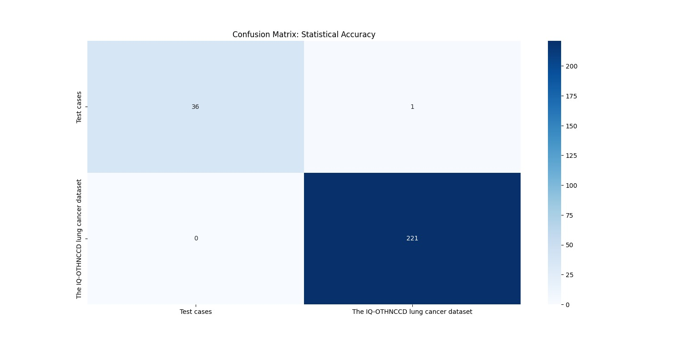
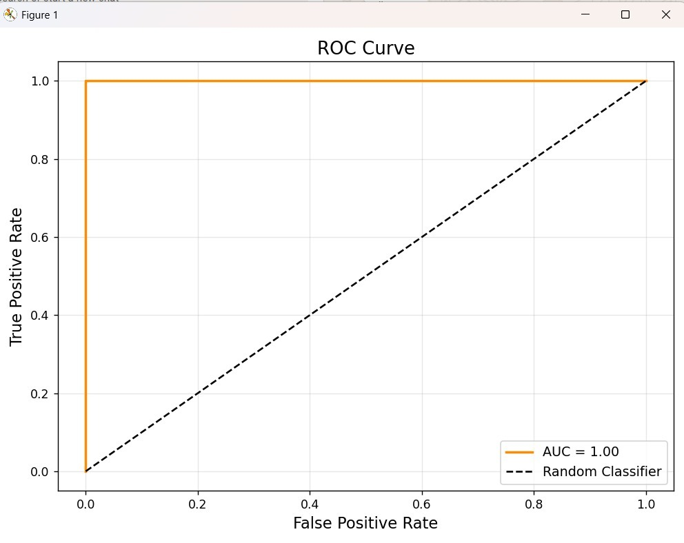

#  Lung Cancer Detection using CNN 
## Project Overview

This project implements a **Convolutional Neural Network (CNN)** to classify lung cancer images into different categories using TensorFlow and Keras. It also includes advanced evaluation metrics and **Explainable AI (Grad-CAM)** to visualize model decision-making.

---

##  Features

* Image classification using CNN
* Automatic dataset extraction from ZIP
* Training & validation split
* Performance evaluation:
  * Accuracy
  * Confusion Matrix
  * Classification Report
  * ROC Curve (Binary & Multi-class)
* Grad-CAM visualization for model interpretability

---

## Dataset

We use a lung cancer image dataset from Kaggle:

[Download Dataset](https://www.kaggle.com/datasets/adityamahimkar/iqothnccd-lung-cancer-dataset)
* Details
- Input: Lung cancer image dataset (ZIP file)
- The dataset is automatically extracted before training.

* Structure:
  ```
  dataset/
    ├── class_1/
    ├── class_2/
    ├── class_3/
  ```
* Automatically extracted before training

---

##  Installation

### 1. Clone the repository

```bash
git clone <your-repo-link>
cd lung-cancer-cnn
```

### 2. Install dependencies

```bash
pip install tensorflow matplotlib numpy seaborn scikit-learn opencv-python
```

---

##  How to Run

1. Update dataset path in the script:

```python
zip_path = "path_to_zip_file"
extract_path = "path_to_extract"
```

2. Run the script:

```bash
python main.py
```

---

##  Model Architecture

* Input Layer (256×256×3)
* Rescaling Layer
* Conv2D + MaxPooling (3 blocks)
* Flatten Layer
* Dense Layer (128 neurons)
* Dropout (0.5)
* Output Layer (Softmax)

---

## Evaluation Metrics

###  Confusion Matrix

* Visualizes prediction vs actual labels



###  Classification Report

* Precision
* Recall
* F1-score

###  ROC Curve

- Binary and multi-class supported
- AUC score included


---

##  Explainable AI (Grad-CAM)

Grad-CAM highlights regions of the image that influenced the model’s prediction.

* Helps in medical interpretability
* Overlays heatmap on original scan

---

##  Output Visualizations

* Batch prediction results with confidence scores
* Confusion matrix heatmap
* ROC curves
* Grad-CAM heatmap overlay

---

##  Training Details

* Image size: 256 × 256
* Batch size: 32
* Epochs: 15
* Optimizer: Adam
* Loss: Sparse categorical crossentropy

---

## ⚠️ Disclaimer

This project is for **educational and research purposes only**.
It is **not intended for clinical diagnosis** or real-world medical use.

---

##  Future Improvements

* Use transfer learning (e.g., ResNet, EfficientNet)
* Hyperparameter tuning
* Data augmentation
* Deployment via web app (Streamlit / Flask)

---
